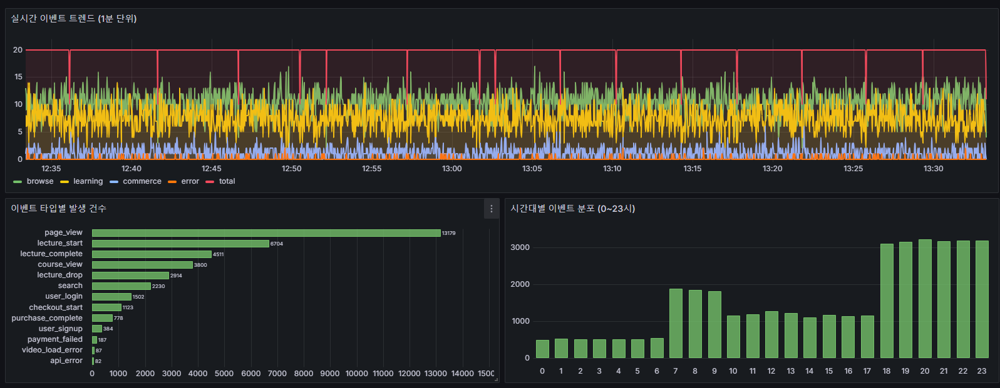
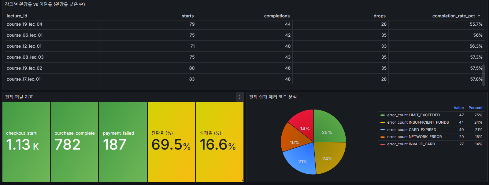

# 이벤트 로그 파이프라인

## 실행 방법

```bash
cp .env.example .env
docker compose up --build
```

위 명령으로 Kafka, ClickHouse, 이벤트 생성기, Consumer, Grafana가 함께 실행됩니다.
이벤트 생성기는 랜덤 이벤트를 Kafka로 전송하고, Consumer는 이를 ClickHouse `events` 테이블에 저장합니다.

- Grafana: http://localhost:3000 (`admin` / `admin`)
- ClickHouse: http://localhost:8123

Grafana의 `LiveClass 이벤트 대시보드`에서 집계 결과를 확인할 수 있습니다.

```bash
docker compose down
docker compose down -v  # 데이터 초기화
```

## 프로젝트 개요

온라인 강의 플랫폼을 가정하고, 사용자의 탐색, 수강, 결제, 에러 이벤트를 생성해 분석하는 이벤트 로그 파이프라인입니다.

```text
Python Simulator -> Kafka -> Python Consumer -> ClickHouse -> Grafana
```

## Step 1. 이벤트 생성기 작성

이벤트 생성기는 Python으로 작성했습니다.
온라인 강의 플랫폼에서 발생할 수 있는 사용자 행동을 랜덤하게 생성하고,
이벤트 성격에 따라 Kafka 토픽으로 전송합니다.

| 구분 | 이벤트 타입 |
|---|---|
| 탐색 | `page_view`, `course_view`, `search` |
| 수강 | `lecture_start`, `lecture_complete`, `lecture_drop` |
| 결제 | `checkout_start`, `purchase_complete`, `payment_failed` |
| 유저 | `user_signup`, `user_login` |
| 에러 | `video_load_error`, `api_error` |

탐색, 수강, 결제, 에러 이벤트를 함께 두어 단순 발생량뿐 아니라
시간대별 트래픽, 결제 전환, 강의 완강률, 장애 비율을 분석할 수 있도록 설계했습니다.
모든 이벤트에는 `event_id`, `event_type`, `event_timestamp`, `received_at`,
`session_id`, `user_id`, 디바이스 정보 등 공통 필드를 포함했습니다.

<details>
<summary>이벤트 생성 로직 상세</summary>

- 기본 생성량은 초당 10건이며, `.env`의 `EVENTS_PER_SECOND`로 조정할 수 있습니다.
- `page_view`, `lecture_start`처럼 자주 발생하는 이벤트는 높은 확률로 생성하고,
  결제 실패나 API 에러는 낮은 확률로 생성되도록 가중치를 두었습니다.
- 사용자 200명, 강의 20개, 강의별 영상 5개 풀에서 값을 샘플링해
  집계 결과가 너무 단조롭지 않도록 했습니다.
- `event_timestamp`는 실제 이벤트 발생 시각입니다.
  저녁 시간대 트래픽이 높게 나오도록 18~23시에 더 큰 가중치를 두었습니다.
- `received_at`은 파이프라인이 이벤트를 수신한 시각입니다.
  적재 지연이나 처리 기준 시간을 구분하기 위해 별도로 두었습니다.
- 로그인 사용자는 여러 이벤트가 같은 `session_id`로 묶이도록 하고,
  익명 사용자는 이벤트마다 별도 세션을 생성합니다.
- Kafka 토픽은 `events.user`, `events.learning`, `events.commerce`, `events.error`로 나누어
  이벤트 성격별로 분리했습니다.

</details>

## Step 2. 로그 저장

이벤트는 Kafka를 거쳐 Python Consumer가 ClickHouse의 `events` 테이블에 저장합니다.
JSON 원문을 통째로 저장하면 매 쿼리마다 파싱이 필요하고 타입 검증도 어려워집니다.
따라서 분석에 필요한 값을 `event_type`, `event_timestamp`, `user_id`,
`amount`, `error_code` 같은 명시적인 컬럼으로 분리해 저장했습니다.

ClickHouse를 선택한 이유는 이벤트 로그처럼 계속 추가되는 데이터를
`COUNT`, `GROUP BY`, 시간 범위 조건으로 빠르게 집계하는 데 적합한
OLAP 컬럼형 DB이기 때문입니다. 개별 row를 자주 수정하는 OLTP 성격보다
대량 이벤트를 모아 분석하는 목적에 맞다고 판단했습니다.

**단일 이벤트 테이블을 선택한 이유**

저장 구조는 이벤트 타입별 테이블을 따로 나누지 않고,
하나의 `events` 테이블에 공통 컬럼과 이벤트별 전용 컬럼을 함께 두는 비정규화 구조로 구성했습니다.
이벤트와 관련 없는 컬럼은 `NULL`로 저장되지만,
ClickHouse는 컬럼형 DB라 쿼리에 필요한 컬럼만 읽을 수 있습니다.

이벤트 타입마다 테이블을 나누는 방식도 고려했지만,
전체 이벤트 수, 시간대별 추이, 결제/수강 이벤트 간 비교 쿼리가 복잡해집니다.
이 과제에서는 여러 이벤트를 같은 시간축에서 비교하고,
Grafana 패널의 SQL을 단순하게 유지하는 것이 더 중요하다고 판단했습니다.

| 구분 | 주요 컬럼 |
|---|---|
| 공통 | `event_id`, `event_type`, `event_timestamp`, `received_at`, `session_id`, `user_id` |
| 환경 | `user_type`, `device_type`, `platform`, `os`, `browser`, `page_url`, `referrer_url` |
| 수강 | `course_id`, `course_title`, `instructor_id`, `lecture_id`, `lecture_duration_sec`, `watch_duration_sec`, `watch_percentage` |
| 결제 | `amount`, `currency`, `payment_method`, `coupon_code`, `discount_amount` |
| 검색 | `query`, `result_count`, `category_filter` |
| 에러 | `error_code`, `error_message`, `endpoint`, `status_code` |

**테이블 엔진과 적재 방식**

- `event_timestamp` 기준으로 월별 파티션을 나누어 시간 범위 조회를 쉽게 했습니다.
- `ORDER BY`에 `event_type`과 날짜를 두어 이벤트 타입별/기간별 집계에 맞췄습니다.
- `ReplacingMergeTree`를 사용해 같은 `event_id`가 재처리될 때 중복 집계 가능성을 줄였습니다.
- Consumer는 500건 이상 또는 5초 경과 시 배치로 insert하여 ClickHouse에 작은 insert가 과도하게 발생하지 않도록 했습니다.
- ClickHouse 적재가 끝난 뒤 Kafka offset을 commit해 저장 전 offset이 먼저 확정되는 상황을 피했습니다.

<details>
<summary>ClickHouse 테이블 스키마</summary>

```sql
CREATE TABLE IF NOT EXISTS default.events
(
    event_id             UUID,
    event_type           LowCardinality(String),
    event_timestamp      DateTime64(3, 'UTC'),
    received_at          DateTime64(3, 'UTC'),
    session_id           String,
    user_id              Nullable(String),
    user_type            LowCardinality(String),
    device_type          LowCardinality(String),
    platform             LowCardinality(String),
    os                   LowCardinality(String),
    browser              Nullable(String),
    page_url             String,
    referrer_url         String,

    course_id            Nullable(String),
    course_title         Nullable(String),
    instructor_id        Nullable(String),
    lecture_id           Nullable(String),
    lecture_duration_sec Nullable(Int32),
    watch_duration_sec   Nullable(Int32),
    watch_percentage     Nullable(Float32),
    total_watch_time_sec Nullable(Int32),
    exit_trigger         Nullable(String),

    amount               Nullable(Int32),
    currency             Nullable(String),
    payment_method       Nullable(String),
    coupon_code          Nullable(String),
    discount_amount      Nullable(Int32),

    query                Nullable(String),
    result_count         Nullable(Int32),
    category_filter      Nullable(String),

    error_code           Nullable(String),
    error_message        Nullable(String),
    endpoint             Nullable(String),
    status_code          Nullable(Int32)
)
ENGINE = ReplacingMergeTree(received_at)
PARTITION BY toYYYYMM(event_timestamp)
ORDER BY (event_type, toDate(event_timestamp), event_id);
```

</details>

## Step 3. 데이터 집계 분석

분석 SQL은 `analysis/` 디렉터리에 분리했습니다.
이벤트 흐름 검증부터 서비스 지표 확인까지 볼 수 있도록 6개 쿼리를 작성했습니다.

| 파일 | 분석 내용 | 목적 |
|---|---|---|
| `01_event_count_by_type.sql` | 이벤트 타입별 발생 건수 | 파이프라인 동작 확인, 이벤트 분포 파악 |
| `02_hourly_distribution.sql` | 시간대별 이벤트 분포 | 피크 타임 확인 |
| `02_time_series_trend.sql` | 시간 흐름별 이벤트 추이 | 실시간 변화와 이상 징후 모니터링 |
| `03_lecture_completion_rate.sql` | 강의별 완강률/이탈률 | 완강률이 낮은 강의 식별 |
| `04_payment_funnel.sql` | 결제 전환율/실패율 | 결제 UX와 장애 지표 확인 |
| `05_payment_error_analysis.sql` | 결제 실패 에러 코드별 집계 | 우선 대응할 결제 오류 파악 |

모든 쿼리는 `events FINAL`을 사용합니다.
`ReplacingMergeTree`의 중복 제거가 백그라운드 병합 전에 완료되지 않았을 수 있으므로,
분석 시점에는 `FINAL`로 중복 제거된 결과를 조회하도록 했습니다.

<details>
<summary>대표 쿼리 예시</summary>

이벤트 타입별 발생 건수입니다.

```sql
SELECT
    event_type,
    count() AS event_count,
    round(count() * 100.0 / sum(count()) OVER (), 2) AS percentage
FROM events FINAL
GROUP BY event_type
ORDER BY event_count DESC;
```

결제 퍼널 전환율과 실패율입니다.

```sql
SELECT
    countIf(event_type = 'checkout_start') AS checkout_start,
    countIf(event_type = 'purchase_complete') AS purchase_complete,
    countIf(event_type = 'payment_failed') AS payment_failed,
    round(
        countIf(event_type = 'purchase_complete') * 100.0
        / NULLIF(countIf(event_type = 'checkout_start'), 0),
        2
    ) AS conversion_rate,
    round(
        countIf(event_type = 'payment_failed') * 100.0
        / NULLIF(countIf(event_type = 'checkout_start'), 0),
        2
    ) AS failure_rate
FROM events FINAL;
```

</details>

## Step 4. Docker로 실행 가능하게 만들기

전체 스택은 `docker-compose.yml`로 구성했습니다.

| 서비스 | 역할 |
|---|---|
| `kafka` | 이벤트 메시지 브로커 |
| `kafka-init` | Kafka 토픽 자동 생성 |
| `simulator` | 랜덤 이벤트 생성 및 Kafka 전송 |
| `consumer` | Kafka 이벤트 소비 후 ClickHouse 적재 |
| `clickhouse` | 이벤트 로그 저장 및 분석 |
| `grafana` | ClickHouse 집계 결과 시각화 |

`consumer`와 `simulator`는 Kafka 토픽 생성 이후 시작되도록 구성했습니다.
ClickHouse와 Kafka에는 healthcheck를 두어 준비된 뒤 다음 서비스가 실행되도록 했습니다.

**Kafka를 중간에 둔 이유**

이벤트 생성기가 DB에 직접 쓰는 대신 Kafka를 둔 이유는 이벤트 생성과 저장을 분리하기 위해서입니다.
저장소가 느려지더라도 Consumer가 처리 가능한 속도로 적재할 수 있는 구조를 의도했습니다.

## Step 5. 결과 시각화

집계 결과는 Grafana 대시보드로 시각화했습니다.
이 파이프라인은 이벤트가 계속 생성되는 구조이므로,
정적인 이미지 생성보다 자동 새로고침이 가능한 대시보드가 더 적합하다고 판단했습니다.

**대시보드 전체 흐름**



**수강/결제 지표**



| 패널 | 사용 쿼리 | 확인 목적 |
|---|---|---|
| 실시간 이벤트 트렌드 | `02_time_series_trend.sql` | 이벤트가 시간 흐름에 따라 쌓이는지 확인 |
| 이벤트 타입별 발생 건수 | `01_event_count_by_type.sql` | 이벤트 분포와 생성 가중치 확인 |
| 시간대별 이벤트 분포 | `02_hourly_distribution.sql` | 저녁 피크 패턴 확인 |
| 강의별 완강률/이탈률 | `03_lecture_completion_rate.sql` | 완강률이 낮은 강의 식별 |
| 결제 퍼널 지표 | `04_payment_funnel.sql` | 구매 전환율과 결제 실패율 확인 |
| 결제 실패 에러 코드 | `05_payment_error_analysis.sql` | 우선 대응할 결제 오류 파악 |

<details>
<summary>Grafana 선택 이유와 패널 구성 의도</summary>

**Grafana를 선택한 이유**

Grafana는 자동 새로고침과 ClickHouse datasource를 지원해,
계속 들어오는 이벤트를 실시간으로 보기 적합했습니다.

**패널을 구성한 기준**

실시간 트렌드, 이벤트 타입 분포, 시간대별 분포 패널은
파이프라인이 정상 동작하는지와 시뮬레이터의 이벤트 패턴이 의도대로 나오는지 확인하기 위해 구성했습니다.

강의 완강률, 결제 퍼널, 결제 실패 에러 패널은 단순 로그 수집을 넘어
콘텐츠 품질, 구매 전환, 장애 원인처럼 서비스 개선에 연결되는 지표를 보기 위해 구성했습니다.

**대시보드 재현성**

datasource와 dashboard는 provisioning 파일로 관리했습니다.
수동 설정을 줄이고 실행 환경이 달라도 같은 대시보드를 재현하기 위해서입니다.

</details>

## 선택 과제. Kubernetes 배포 설계

이벤트 생성기 앱을 Kubernetes에 배포한다고 가정하고 `k8s/` 디렉터리에 매니페스트를 작성했습니다.
실제 클러스터 배포까지 수행하지는 않았고, simulator 컨테이너를 배포 대상으로 잡았습니다.

| 파일 | 리소스 | 역할 |
|---|---|---|
| `namespace.yaml` | `Namespace` | 과제 리소스를 `liveclass` 네임스페이스로 분리 |
| `configmap.yaml` | `ConfigMap` | Kafka 주소와 이벤트 생성량 설정 관리 |
| `deployment.yaml` | `Deployment` | simulator Pod 실행, replica와 리소스 요청/제한 관리 |

`Namespace`는 다른 워크로드와 리소스를 논리적으로 분리하기 위해 사용했습니다.
`ConfigMap`은 `KAFKA_BROKER`, `EVENTS_PER_SECOND`처럼 환경마다 달라질 수 있는 값을 이미지와 분리하기 위해 사용했습니다.
`Deployment`는 Pod가 종료되더라도 다시 생성되는 기본 복구 동작을 제공하고, replica 수와 리소스 제한을 명시할 수 있어 선택했습니다.

simulator는 이벤트를 생성하는 역할이므로 `replicas: 1`로 설정했습니다.
복제 수를 늘리면 이벤트 생성량도 함께 증가하므로, 이 과제에서는 예측 가능한 이벤트 양을 유지하는 구성이 더 적합하다고 판단했습니다.
